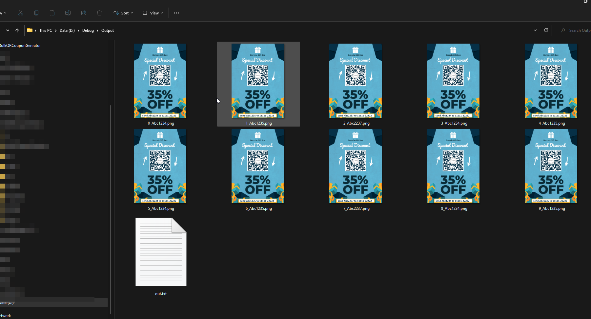

# Bulk QR Coupon Generator


A Windows desktop application for generating bulk QR code coupons with customizable templates. Perfect for marketing campaigns, promotional materials, and coupon distribution.

## Features

- **Bulk QR Code Generation**: Generate hundreds of unique QR codes from a CSV file
- **Customizable QR Codes**: Set position, size, and color of QR codes on your template
- **Logo Embedding**: Add your brand logo in the center of each QR code
- **Dynamic Text Overlay**: Add customizable text with the coupon code on each image
- **Live Preview**: Preview your coupon design before bulk generation
- **Settings Persistence**: Your configuration is automatically saved for future sessions
- **Material Design UI**: Modern, intuitive user interface

## Screenshots

| Main Interface | Generated Output |
|----------------|------------------|
|  |  |

## Requirements

- Windows 10 or later
- .NET Framework 4.7 or later
- Visual Studio 2017+ (for building from source)

## Installation

### From Source

1. Clone the repository:
   ```bash
   git clone https://github.com/akshaynikhare/Bulk-QR-Coupon-Generator.git
   ```

2. Open `BulkQRCouponGenerator.sln` in Visual Studio

3. Restore NuGet packages (automatically done on build)

4. Build and run the solution

## Usage

### Step 1: Prepare Your Files

1. **Base Image**: Create your coupon template image (JPG/PNG format)
2. **Logo on QR**: Prepare a logo image to embed in QR codes (PNG recommended)
3. **CSV File**: Create a CSV file with coupon codes (one code per line with header)

Example CSV format:
```csv
Code
ABC1234
ABC1235
XYZ9999
```

### Step 2: Configure the Application

1. **Base Image**: Select your coupon template
2. **Logo on QR**: Select the logo to embed in QR codes
3. **Input CSV**: Select your CSV file with codes
4. **Output Folder**: Choose where to save generated images

### Step 3: Customize QR Code Settings

- **Position (X, Y)**: Set where the QR code appears on the template
- **Size (X, Y)**: Set the dimensions of the QR code
- **Color**: Choose the QR code color (hex format, e.g., `#073147`)
- **QR Web Link**: Define the URL pattern using `{code}` as placeholder
  - Example: `https://example.com/redeem?code={code}`

### Step 4: Customize Text Overlay

- **Position (X, Y)**: Set where the text appears
- **Font Size**: Choose the text size
- **Color**: Set the text color (hex format)
- **Font**: Select from system fonts
- **Text**: Define the text pattern using `{code}` as placeholder
  - Example: `Send {code} to 11111-22222`

### Step 5: Generate

1. Click **Preview** to see a sample output
2. Click **Bulk Generate** to create all coupon images

## Input Folder Structure

Place your default input files in the `Input` folder:
```
Input/
├── Base_image.jpg    # Default template image
├── Logo_on_QR.png    # Default QR logo
└── Import_Code.csv   # Default code list
```

## Dependencies

- [QRCoder](https://github.com/codebude/QRCoder) - QR code generation
- [Material Design In XAML](http://materialdesigninxaml.net/) - Modern UI components
- [Ookii.Dialogs.Wpf](https://github.com/ookii-dialogs/ookii-dialogs-wpf) - Folder browser dialogs

## License

This project is open source. Feel free to use, modify, and distribute.

## Contributing

Contributions are welcome! Please feel free to submit a Pull Request.

## Author

[Akshay Nikhare](https://github.com/akshaynikhare)
